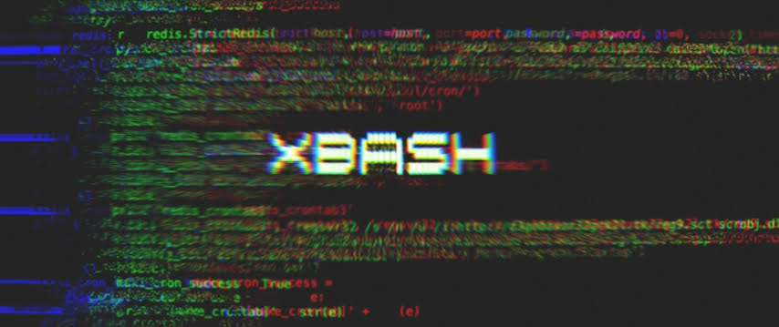

<h1 align="center">XBash Malware Files
</h1>
</ br>
<br>


* ` Executive Summary`
> Unit 42 researchers have found a new malware family that is targeting Linux and Microsoft Windows servers. We can tie this malware, which we have named Xbash, to the Iron Group, a threat actor group known for previous ransomware attacks.> Xbash has ransomware and coinmining capabilities. It also has self-propagating capabilities (meaning it has worm-like characteristics similar to WannaCry or Petya/NotPetya). It also has capabilities not currently implemented that, when implemented, could enable it to spread very quickly within an organizations’ network (again, much like WannaCry or Petya/NotPetya)`> Xbash spreads by attacking weak passwords and unpatched vulnerabilities

> Xbash is data-destructive; destroying Linux-based databases as part of its ransomware capabilities. We can also find no functionality within Xbash that would enable restoration after the ransom is paid. This means that, similar to NotPetya, Xbash is data destructive malware posing as ransomware.

## Disclaimer
*This is for educational purposes only !*<br>
_Use it at your own risk_<br>
*I will not be responsible for any misuse*⚠️

## Usage 
```sh
bash script.sh 

```

## For more information checkout
* [Palo Alto Networks Report](https://researchcenter.paloaltonetworks.com/2018/09/unit42-xbash-combines-botnet-ransomware-coinmining-worm-targets-linux-windows/)

