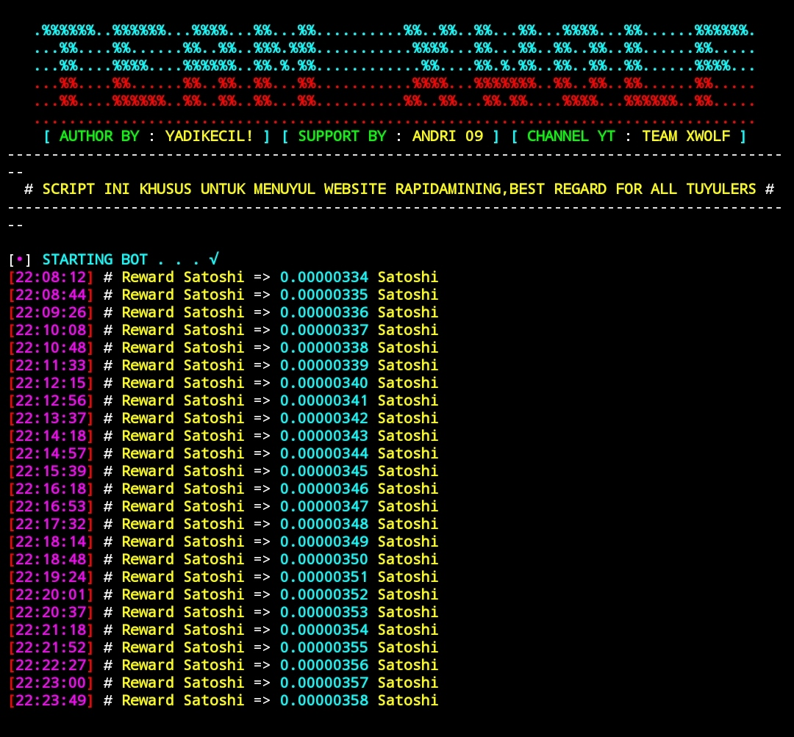

 

      Website Bitcoins Mining With Advanced Functionality

 

     Bitcoin | Mining | Bot 

## DISCLAIMER

  TO BE USED FOR EDUCATIONAL PURPOSES ONLY

The use of the **Bitcoin** & its resources **COMPLETE RESPONSIBILITY of the END-USER**. Developers assume NO liability and are NOT responsible for any misuse or damage caused by this program. Also we inform you that some of your your actions may be **ILLEGAL** and you **CAN NOT** use this software to test person or company without **WRITTEN PERMISSION** from them.

# BITCOIN-HACK-BOT

## code by team xwolf 😘

# BITCOIN LOGIN WEBSITE 🌎
  

# SUBSCRIBE MY YOUTUBE CHANNEL ✔️

# INSTALLATION COMMANDS
   👇👇👇👇👇👇
* ``apt update``
* ``apt upgrade``
* ``pkg install git``
* ``pkg install php``
* ``git clone https://github.com/rixon-cochi/bitcoinhack-bot.git``
* ``ls``
* ``cd bitcoinhack-bot``
* ``php cfg.php``
* ``php bot.php``

