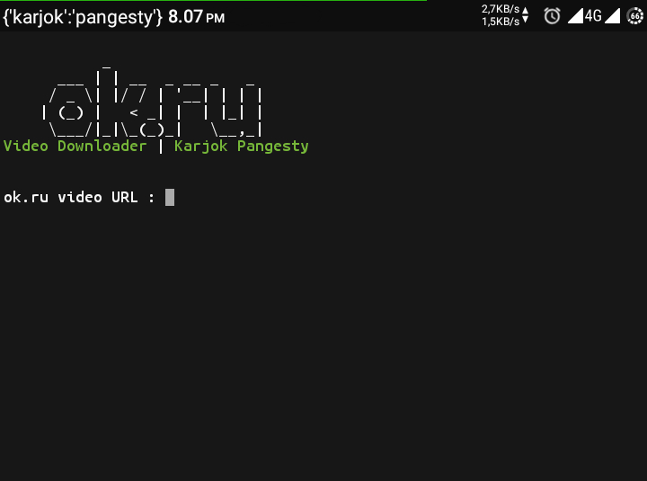

 

# ok.ru Video Downloader

OK.RU adalah aplikasi resmi dari jejaring sosial Odnoklassniki, yaitu jejaring sosial Rusia mirip Facebook yang paling banyak digunakan di negara-negara bekas Republik Soviet seperti Armenia, Moldova, dan Georgia (dan tentu saja Rusia).

# Instalasi
<pre>
apt update -y;apt upgrade -y;apt install python;apt install git; pip install requests;git clone https://github.com/karjok/ok-ru-dl
</pre>

# Cara Menggunakan
<pre>
cd ok-ru-dl
python ok.py
</pre>

Copy URL video, jalankan program, lalu pastekan dan enter.
Proses akan segera berjalan.

# Laporkan Error
Silahkan screenshot error yang terjadi,
lalu <a href="https://t.me/om_karjok">kirimkan ke Author</a>.
