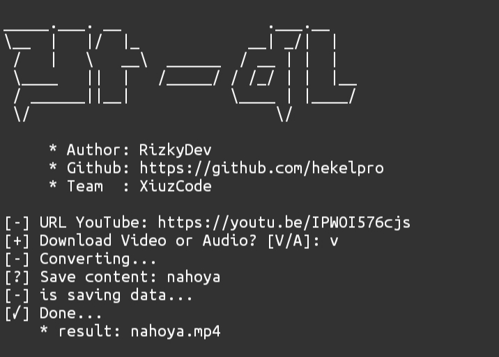

# yt-dl for website 

not support for mp4, only with mp3

<ul><li>Demo: <a href="http://rizkydev.my.id/music-dl/" target="_blank">rizkydev.my.id</a><li>Source code: <a href="ytdl-templates">github.com/hekelpro</a></ul>

# yt-dl for CLI

support for mp3 and mp4

<ul><li>pkg update && pkg upgrade</li><li>pkg install git</li><li>pkg install python</li><li>python3 -m pip install requests</li><li>termux-setup-storage</li><li>git clone https://github.com/hekelpro/yt-dl</li><li>cd yt-dl</li><li>python yt-dl.py</li></ul>
